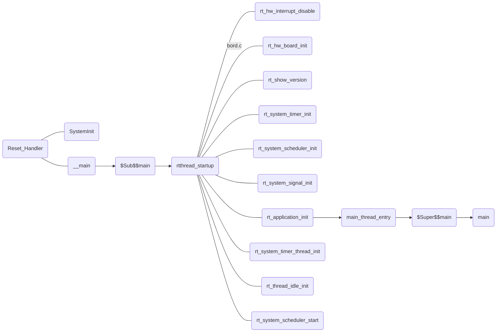

# RT-Thread启动过程



# 线程管理
- 修改`main.c`

```c
#include "rtthread.h"
#include "main.h"

/*
*************************************************************************
*                               变量
*************************************************************************
*/
/* 定义线程控制块 */
static rt_thread_t led1_thread = RT_NULL;
static rt_thread_t key_thread = RT_NULL;
/*
*************************************************************************
*                             函数声明
*************************************************************************
*/
static void led1_thread_entry(void* parameter);
static void key_thread_entry(void* parameter);

int main(void)
{

    rt_kprintf("prss K1 suspend,prss K2 resume\n");
    led1_thread =                          /* 线程控制块指针 */
        rt_thread_create( "led1",              /* 线程名字 */
                          led1_thread_entry,   /* 线程入口函数 */
                          RT_NULL,             /* 线程入口函数参数 */
                          512,                 /* 线程栈大小 */
                          3,                   /* 线程的优先级 */
                          20);                 /* 线程时间片 */

    /* 启动线程，开启调度 */
    if (led1_thread != RT_NULL)
        rt_thread_startup(led1_thread);
    else
        return -1;
    key_thread =                          /* 线程控制块指针 */
        rt_thread_create( "key",              /* 线程名字 */
                          key_thread_entry,   /* 线程入口函数 */
                          RT_NULL,             /* 线程入口函数参数 */
                          512,                 /* 线程栈大小 */
                          2,                   /* 线程的优先级 */
                          20);                 /* 线程时间片 */

    /* 启动线程，开启调度 */
    if (key_thread != RT_NULL)
        rt_thread_startup(key_thread);
    else
        return -1;
}
/**
 * @brief  led1_thread线程主体
 * @param  parameter 参数
 * @retval 无
 */
static void led1_thread_entry(void* parameter)
{
    while (1)
    {
        LED1(ON);
        rt_thread_delay(500);   /* 延时500个tick */
        rt_kprintf("led1_thread running,LED1_ON\r\n");
        LED1(OFF);
        rt_thread_delay(500);   /* 延时500个tick */
        rt_kprintf("led1_thread running,LED1_OFF\r\n");
    }
}
/**
 * @brief  key_thread线程主体
 * @param  parameter 参数
 * @retval 无
 */
static void key_thread_entry(void* parameter)
{
    rt_err_t uwRet = RT_EOK;
    while (1)
    {
        if( Key_Scan(KEY1_GPIO_PORT,KEY1_GPIO_PIN) == KEY_ON )/* K1 被按下 */
        {
            printf("suspend LED1 thread!\n");
            uwRet = rt_thread_suspend(led1_thread);/* 挂起LED1线程 */
            if(RT_EOK == uwRet)
            {
                rt_kprintf("suspend LED1 thread success! \n");
            }
            else
            {
                rt_kprintf("suspend LED1 thread fail,err:0x%lx\n",uwRet);
            }
        }
        if( Key_Scan(KEY2_GPIO_PORT,KEY2_GPIO_PIN) == KEY_ON )/* K1 被按下 */
        {
            printf("resume LED1 thread!\n");
            uwRet = rt_thread_resume(led1_thread);/* 恢复LED1线程！ */
            if(RT_EOK == uwRet)
            {
                rt_kprintf("resume LED1 thread success!\n");
            }
            else
            {
                rt_kprintf("resume LED1 thread fail,err:0x%lx\n",uwRet);
            }
        }
        rt_thread_delay(20);
    }
}

```
# 调试
- 编译下载到开发板
- 按下K1，可以看到开发板上的灯也不闪烁了，同时在串口调试助手也输出了相应的信息，说明线程已经被挂起，
- 按下K2，可以看到开发板上的灯也恢复闪烁了，同时在串口调试助手也输出了相应的信息，说明线程已经被恢复